# 🚀 Blogging Website 🚀

## Overview

This project is a simple blogging website built with Node.js, Express, and MongoDB. It allows users to sign up, log in, create posts, and comment on posts. The application uses JWT for authentication and authorization.
## Project Structure

```bash
.
├── controllers
│   ├── auth.js
│   └── post.js
├── middlewares
│   ├── auth.js
│   └── roleMiddleware.js
├── models
│   ├── auth.js
│   └── post.js
├── routes
│   ├── auth.js
│   └── post.js
├── .env
├── package.json
├── server.js
└── README.md
```

## Images

#### 1. `Sign-up API`

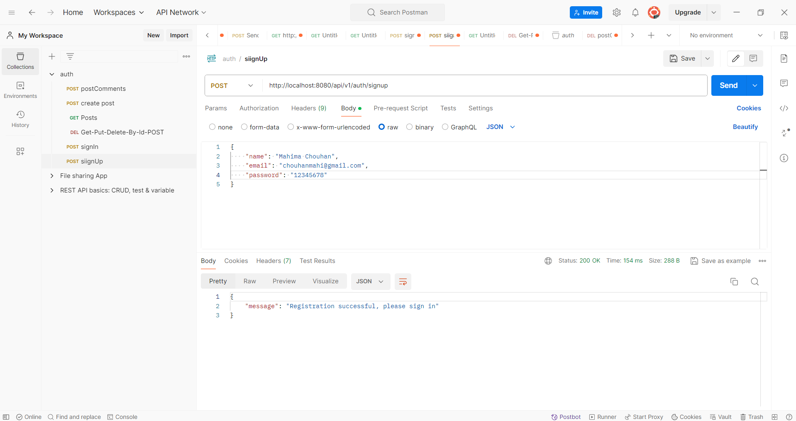

#### 2. `Login API`

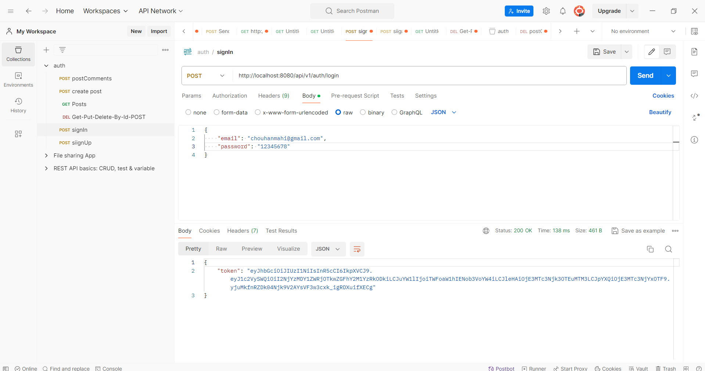

#### 3. `Get Post List API`

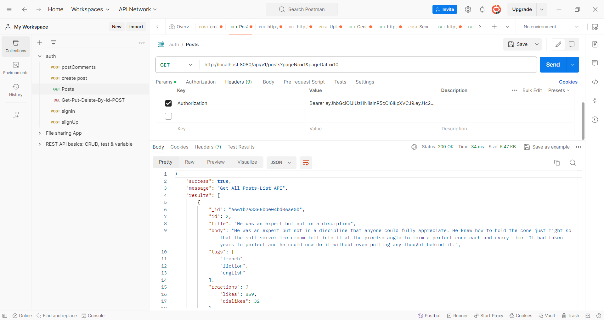

#### 4. `Create Post API`

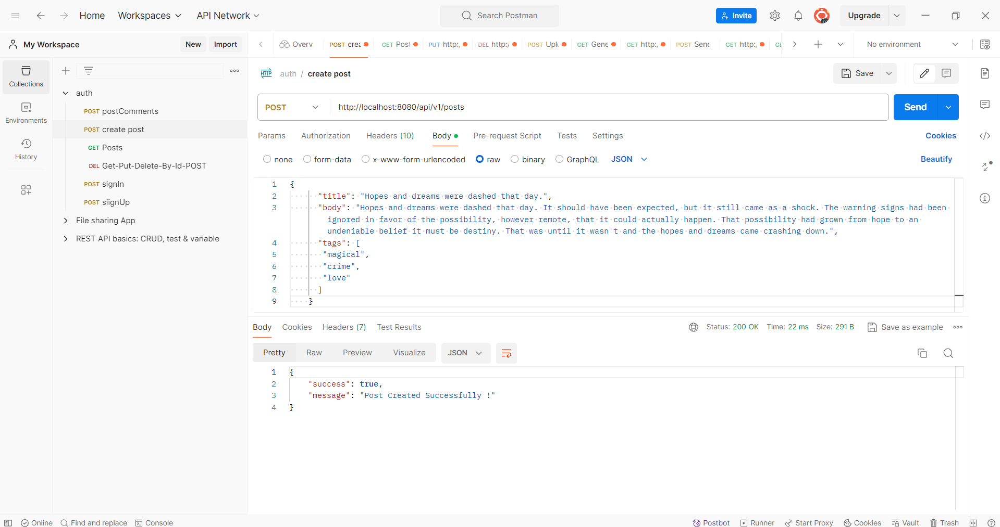

#### 5. `Get Post by ID API`

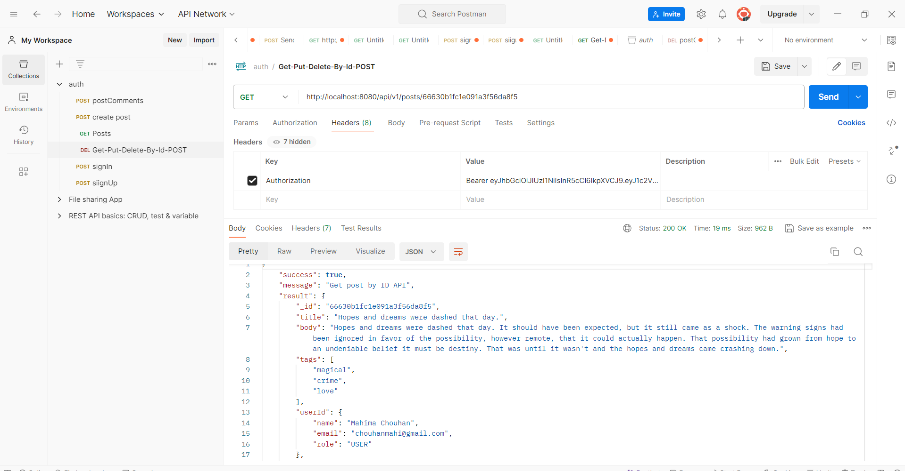

#### 6. `Update Post API`

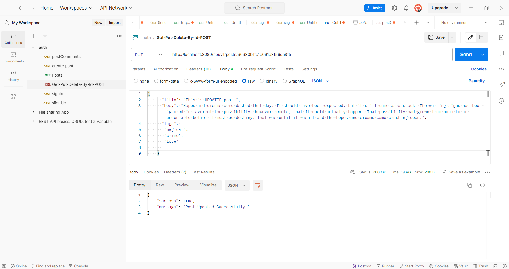

#### 7. `Delete Post API`

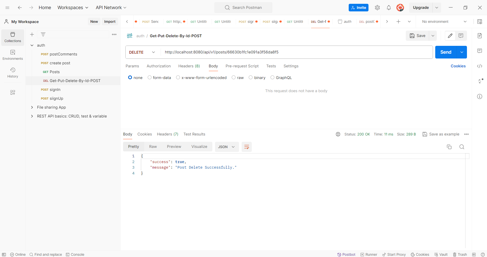

#### 8. `Post Comment API`

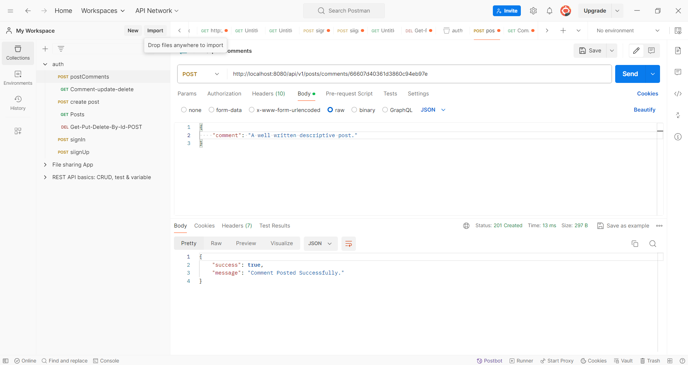

#### 9. `Update Comment API`

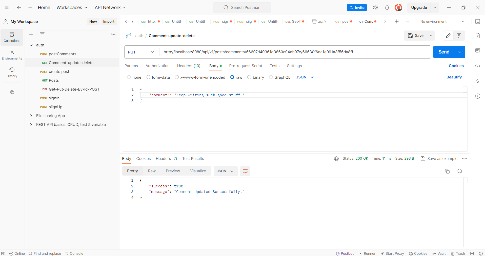

#### 10. `Delete Comment API`

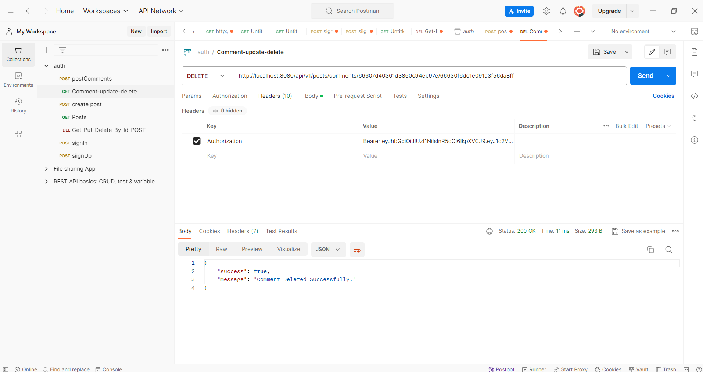

#### 11. `USER Data`

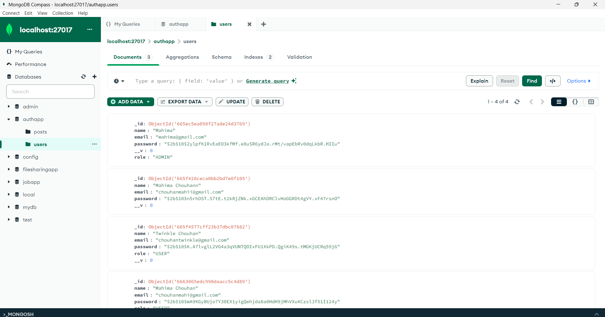

#### 12. `POST Data`

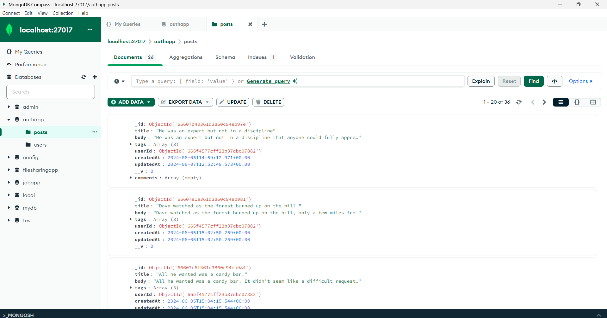

#### 13. `Comment Data`

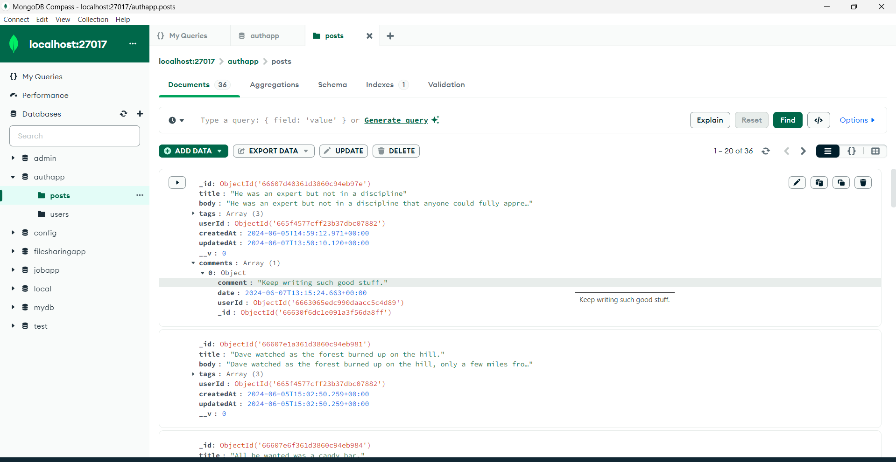

## Features

* `User Authentication`: Sign up and log in with email and password.

* `Authorization`: JWT-based authentication middleware.

* `CRUD Operations for Posts`: Create, read, update, and delete posts.

* `Comment on Posts`: Users can comment on posts, update their comments, and delete their comments.

* `Pagination`: List posts with pagination support.

* `Role-Based Access Control`: Different roles for users (e.g., Admin, User, Content-Creater).

## Installation

1. Clone the Repository:

```bash
git clone https://github.com/chouhanmahima/Blogging-Website.git
```
2. Install Dependencies

```bash
npm install
```
3. Environment Variables:
Create a `.env` file in the root directory and add the following:

```env
SECRET_KEY=your_jwt_secret_key
```

4. Run the Application:

```bash
npm start
```

5. Access the Application:
Open your browser and go to `http://localhost:8080`.


## 1. `controllers/auth.js`

Handles user authentication:

* `signUp`: Registers a new user with a hashed password.

* `login`: Authenticates a user and returns a JWT token.

## 2. `controllers/post.js`

Handles CRUD operations for posts and comments:

* `listPosts`: Lists posts with pagination.

* `createPost`: Creates a new post.

* `getPostById`: Retrieves a post by ID.

* `editPost`: Updates a post by ID.

* `deletePost`: Deletes a post by ID.

* `postComment`: Adds a comment to a post.

* `updateComment`: Updates a comment on a post.

* `deleteComment`: Deletes a comment on a post.

## 3. middlewares/auth.js

JWT-based authentication middleware:

* `validateUser`: Validates the JWT token and user ID.

## 4. `middlewares/roleMiddleware.js

Role-based access control middleware:

* `roleMiddleware`: Validates the user's role.`

## 5. `models/auth.js

User model schema:

* `name`: User's name.

* `email`: User's email (unique).

* `password`: User's hashed password.

* `role`: User's role.`

## 6. `models/post.js`

Post model schema:

* `title`: Post title.

* `body`: Post content.

* `tags`: Post tags (optional).

* `userId`: Reference to the user who created the post.

* `comments`: Array of comments with user references and content.

## 7. `routes/auth.js`

Auth routes:

* POST `/signup`: User registration.

* POST `/login`: User login.

## 8. `routes/post.js`

Post routes:

* `GET /`: List all posts.

* `POST /`: Create a new post.

* `GET /`
: Get a post by ID.

* `PUT /`
: Update a post by ID.

* `DELETE /`
: Delete a post by ID.

* `POST /comments/`
: Add a comment to a post.

* `PUT /comments/
/`
: Update a comment on a post.

* `DELETE /comments/
/`
: Delete a comment on a post.

## Usage

### Registration

To register a new user:

```sh
POST /api/v1/signup
Content-Type: application/json

{
    "name": "Name Example",
    "email": "name.Ex@example.com",
    "password": "your_password"
}
```

### Login

To log in as a user:

```sh
POST /api/v1/login
Content-Type: application/json

{
    "email": "name.Ex@example.com",
    "password": "your_password"
}
```

### Creating a Post

To create a new post:

```sh
POST /api/v1/posts
Authorization: Bearer <your_jwt_token>
Content-Type: application/json

{
    "title": "My First Post",
    "body": "This is the content of the post",
    "tags": ["tag1", "tag2"]
}
```

### Listing Posts

To list posts:

```sh
GET /api/v1/posts?pageNo=1&pageData=10
Authorization: Bearer <your_jwt_token>
```

### Commenting on a Post

To comment on a post:

```sh
POST /api/v1/posts/comments/<postId>
Authorization: Bearer <your_jwt_token>
Content-Type: application/json

{
    "comment": "This is a comment."
}
```

## Dependecies

```bash
{
    "bcrypt": "^5.1.1",
    "dotenv": "^16.4.5",
    "express": "^4.19.2",
    "jsonwebtoken": "^9.0.2",
    "mongoose": "^8.4.1"
}
```

## License

This project is licensed under the MIT License.